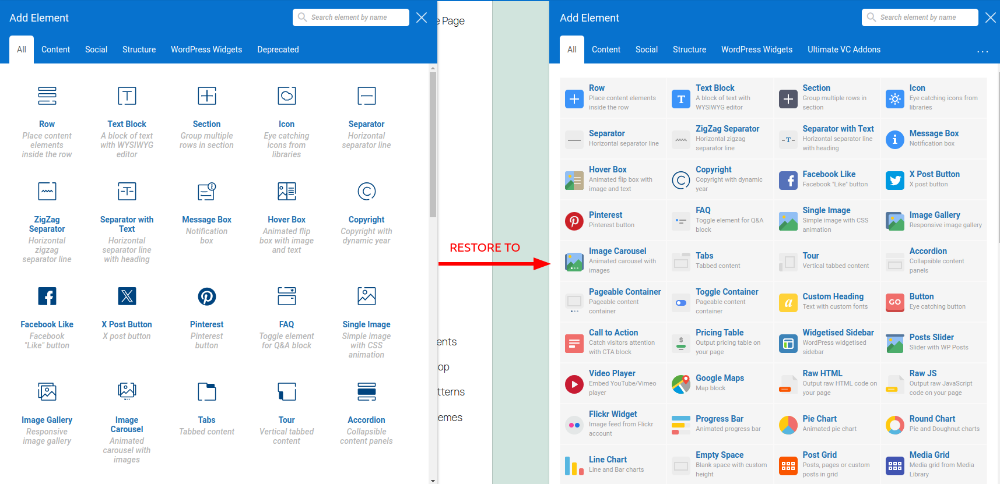
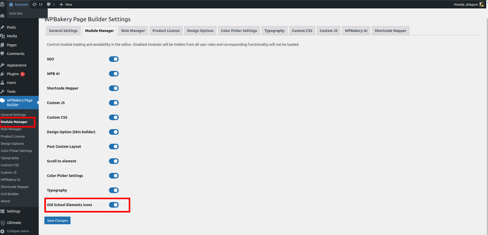

## Description

This WordPress plugin adds a module to [WPBakery Page Builder](https://wpbakery.com), bringing back the old school style of editor elements icons used in versions prior to 8.0.

If, like me, you fall in love with interfaces you've used for decades, then this plugin can be useful for you if you don’t feel comfortable with the new 'Add Element' popup icons in WPBakery Page Builder introduced after version 8.0.
After installing the plugin, you can enjoy the old icon style again in both the backend and frontend WPBakery Page Builder editors. You can always switch it on or off in the Module interface on the WPBakery Page Builder settings page.

## Installation
It's a recommended to use the [official plugin page on WordPress.org](https://wordpress.org/plugins/add-old-school-elements-icons-module-for-wpbakery-page-builder).

Also as an option, you can directly install the plugin from GitHub repository.
1. Clone the repository to the `/wp-content/plugins/` directory.
2. Activate the plugin through the 'Plugins' menu in WordPress.

That's it. Right now if you go to any WPBakery Page Builder editor you can enjoy old-school element icons.

## Requirements
1. WPBakery Page Builder version 8.0+
2. PHP version 5.6+
3. Wordpress version 4.9+

And remember as this plugin is just a regular WPBakery module you can always switch it on/off in WPBakery modules settings.

